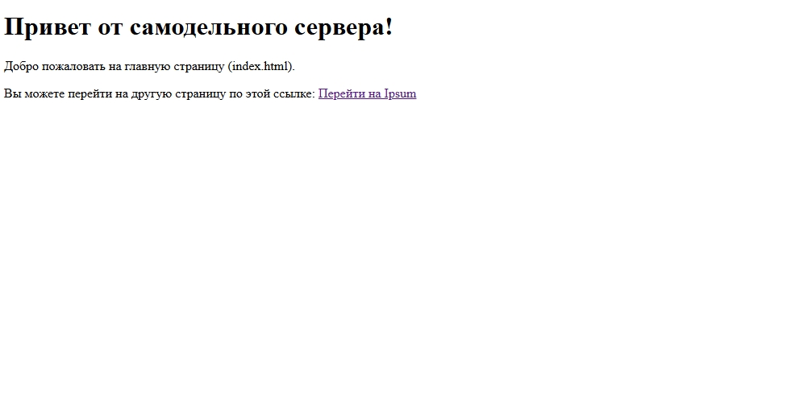
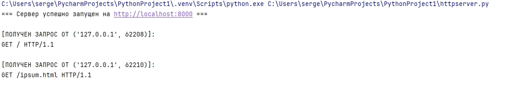

# Руководство по созданию простого HTTP-сервера на Python

В данном руководстве мы рассмотрим процесс создания базового веб-сервера на языке Python с использованием сетевых сокетов низкого уровня. Наш сервер будет способен принимать HTTP-запросы от браузера, анализировать их, возвращать HTML-страницы и корректно обрабатывать ошибки, если запрашиваемый ресурс не найден.

[Туториал](https://joaoventura.net/blog/2017/python-webserver/) был взят из приложенного к заданию списка [технологий](https://github.com/codecrafters-io/build-your-own-x?tab=readme-ov-file#build-your-own-shell)

## Схема взаимодействия клиент-сервер


## Предварительная подготовка
Используемые технологии
- Python 
- Модуль socket (системное абстрагирование для работы с сетевыми байтовыми потоками)

## Структура проекта
Перед началом работы создадим директорию проекта и поместим в неё папку htdocs, где будут храниться файлы:

## Начало работы
HTTP (HyperText Transfer Protocol) — это текстовый протокол. Любой запрос от браузера и любой ответ сервера представляют собой обычные строки, разделенные определенным образом.

Базовый формат любого HTTP-запроса выглядит так:
```python
GET /index.html HTTP/1.0
Host: localhost:8000
User-Agent: Mozilla/5.0
[Пустая строка]
```
Напишем базовый каркас сетевого приложения, который будет слушать входящие подключения.

## Создание сетевого сокета

Создадим файл httpserver.py. Нам понадобится инициализировать TCP-сокет, привязать его к хосту и порту, а затем запустить бесконечный цикл ожидания клиентов.

```python
import socket
# Определяем хост и порт сервера
SERVER_HOST = '0.0.0.0'  
SERVER_PORT = 8000

# Создаем TCP-сокет
server_socket = socket.socket(socket.AF_INET, socket.SOCK_STREAM)

# Разрешаем повторное использование порта сразу после перезапуска сервера
server_socket.setsockopt(socket.SOL_SOCKET, socket.SO_REUSEADDR, 1)

# Привязываем сокет к адресу и порту
server_socket.bind((SERVER_HOST, SERVER_PORT))

server_socket.listen(1)
print(f'Сервер запущен и слушает порт {SERVER_PORT}...')
```
## Обработка первого подключения ("Hello World")

Добавим бесконечный цикл while True, который будет принимать соединение, считывать байты запроса от браузера и отправлять обратно текстовый HTTP-ответ.
```python
while True:    
    # Ждем подключения клиента
    client_connection, client_address = server_socket.accept()

    # Получаем запрос от клиента (считываем первые 1024 байта и декодируем в текст)
    request = client_connection.recv(1024).decode('utf-8')
    print("--- Получен запрос ---")
    print(request)

    # Формируем сырой HTTP-ответ 
    response = 'HTTP/1.0 200 OK\n\nHello World'
    
    # Отправляем байты клиенту и закрываем соединение
    client_connection.sendall(response.encode('utf-8'))
    client_connection.close()

# Закрываем серверный сокет при выходе (опционально)
server_socket.close()
```
Остальная часть кода понятна сама собой: ожидание подключения клиента, чтение строки запроса, отправка строки в формате HTTP с текстом "Hello World" в теле ответа и закрытие соединения с клиентом. Мы делаем это бесконечно (или пока кто-нибудь не нажмет Ctrl+C). Откроем свой браузер по адресу http://localhost:8000/, и мы должны увидим ответ сервера:



## Чтение статического файла index.html

Возвращать жестко прописанную строку неудобно. Настроим сервер так, чтобы при обращении к корню сайта он читал файл htdocs/index.html.

Создадим файл htdocs/index.html:
```html
<!DOCTYPE html>
<html lang="ru">
<head>
    <meta charset="UTF-8">
    <title>Главная страница</title>
</head>
<body>
    <h1>Привет от самодельного сервера!</h1>
    <p>Добро пожаловать на главную страницу (index.html).</p>
    <p>Вы можете перейти на другую страницу по этой ссылке: <a href="/ipsum.html">Перейти на Ipsum</a></p>
</body>
</html>
```
Изменим логику внутри цикла while True:

```python
    # Читаем содержимое файла index.html
    try:
        with open('htdocs/index.html', 'r', encoding='utf-8') as fin:
            content = fin.read()
        
        # Склеиваем HTTP-заголовки и контент файла
        response = 'HTTP/1.0 200 OK\n\n' + content
    except FileNotFoundError:
        response = 'HTTP/1.0 404 NOT FOUND\n\nФайл index.html не найден'

    client_connection.sendall(response.encode('utf-8'))
    client_connection.close()
```

## Динамический парсинг пути и поддержка разных страниц

Сейчас, какую бы страницу ни запросил браузер (например, http://localhost:8000/ipsum.html), сервер всё равно вернет index.html. Нам нужно научиться парсить первую строчку HTTP-запроса, вытаскивать оттуда путь к файлу и отдавать именно его.

Создадим файл htdocs/ipsum.html:
```html
<!DOCTYPE html>
<html lang="ru">
<head>
    <meta charset="UTF-8">
    <title>Страница Ipsum</title>
</head>
<body>
    <h1>Страница Ipsum!</h1>
    <p>Lorem ipsum dolor sit amet, consectetur adipiscing elit.</p>
    <p><a href="/">Вернуться на главную</a></p>
</body>
</html>
```

Обновим парсинг заголовков в коде сервера:
```python
if not request.strip():
        client_connection.close()
        continue

    # Парсим HTTP-заголовки. Разбиваем по строкам.
    lines = request.split('\n')
    # Первая строка выглядит так: "GET /ipsum.html HTTP/1.1"
    # Разбиваем её по пробелам и берем второй элемент (индекс 1) — путь к файлу
    filename = lines[0].split()[1]

    # Если пользователь запрашивает корень '/', подменяем на '/index.html'
    if filename == '/':
        filename = '/index.html'

    # Пытаемся открыть файл из папки htdocs
    try:
        with open('htdocs' + filename, 'r', encoding='utf-8') as fin:
            content = fin.read()
        response = 'HTTP/1.0 200 OK\n\n' + content
    except FileNotFoundError:
        # Если файла нет — формируем заголовок 404 ошибки
        response = 'HTTP/1.0 404 NOT FOUND\n\nСтраница не найдена (404)'

    client_connection.sendall(response.encode('utf-8'))
    client_connection.close()
```


Теперь ссылки на сайте работают корректно, а при вводе несуществующего адреса сервер выдает статус 404 NOT FOUND вместо падения.



## Итог
Мы создали работающий HTTP-сервер, который функционирует на самом низком сетевом уровне (TCP/IP сокеты) без использования тяжеловесных веб-фреймворков.
В ходе выполнения проекта были изучены основы протокола HTTP, структура текстовых заголовков запросов и ответов, а также реализован механизм динамической генерации веб-страниц на стороне сервера на основе системных метрик операционной системы.
