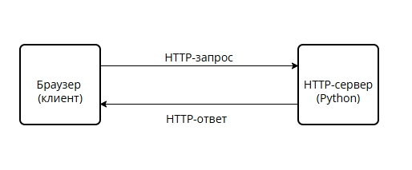

# Руководство по созданию простого HTTP-сервера на Python

В данном руководстве мы рассмотрим процесс создания базового веб-сервера на языке Python с использованием сетевых сокетов низкого уровня. Наш сервер будет способен принимать HTTP-запросы от браузера, анализировать их, возвращать HTML-страницы и корректно обрабатывать ошибки, если запрашиваемый ресурс не найден.

[Туториал](https://joaoventura.net/blog/2017/python-webserver/) был взят из приложенного к заданию списка [технологий](https://github.com/codecrafters-io/build-your-own-x?tab=readme-ov-file#build-your-own-shell)

## Схема взаимодействия клиент-сервер



## Предварительная подготовка
Используемые технологии
- Python 
- Модуль socket (системное абстрагирование для работы с сетевыми байтовыми потоками)

## Структура проекта
Перед началом работы создадим директорию проекта и поместим в неё папку htdocs, где будут храниться файлы:

## Начало работы
HTTP (HyperText Transfer Protocol) — это текстовый протокол. Любой запрос от браузера и любой ответ сервера представляют собой обычные строки, разделенные определенным образом.

Базовый формат любого HTTP-запроса выглядит так:
```python
GET /index.html HTTP/1.0
Host: localhost:8000
User-Agent: Mozilla/5.0
[Пустая строка]
```
Напишем базовый каркас сетевого приложения, который будет слушать входящие подключения.

## Создание сетевого сокета

Создадим файл httpserver.py. Нам понадобится инициализировать TCP-сокет, привязать его к хосту и порту, а затем запустить бесконечный цикл ожидания клиентов.

```python
import socket
# Определяем хост и порт сервера
SERVER_HOST = '0.0.0.0'  
SERVER_PORT = 8000

# Создаем TCP-сокет
server_socket = socket.socket(socket.AF_INET, socket.SOCK_STREAM)

# Разрешаем повторное использование порта сразу после перезапуска сервера
server_socket.setsockopt(socket.SOL_SOCKET, socket.SO_REUSEADDR, 1)

# Привязываем сокет к адресу и порту
server_socket.bind((SERVER_HOST, SERVER_PORT))

server_socket.listen(1)
print(f'Сервер запущен и слушает порт {SERVER_PORT}...')
```
