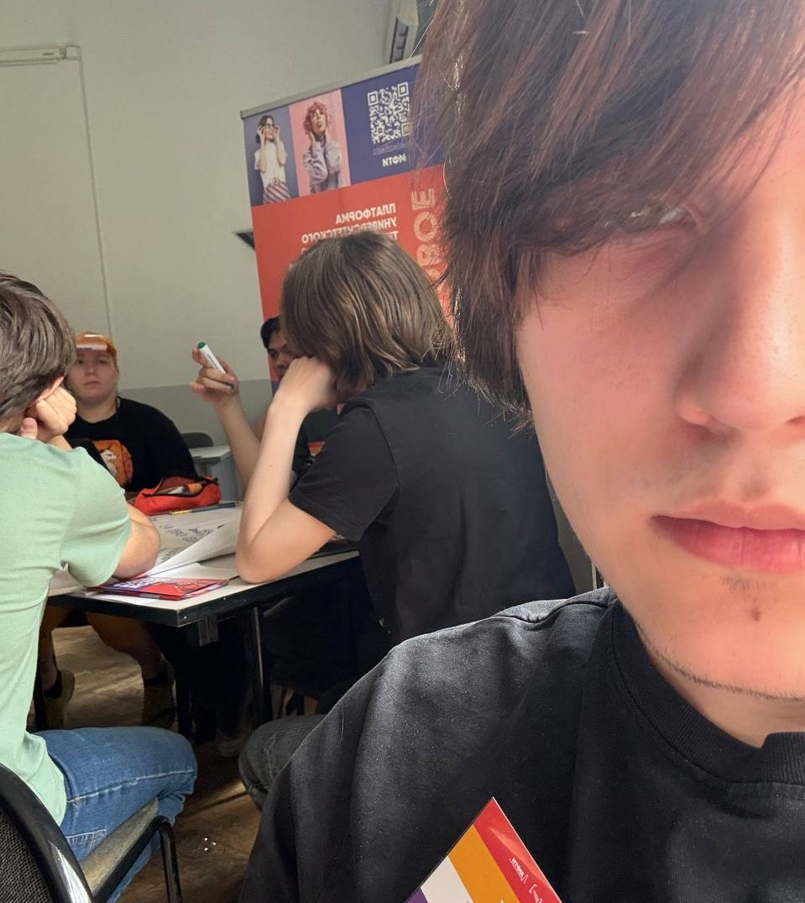
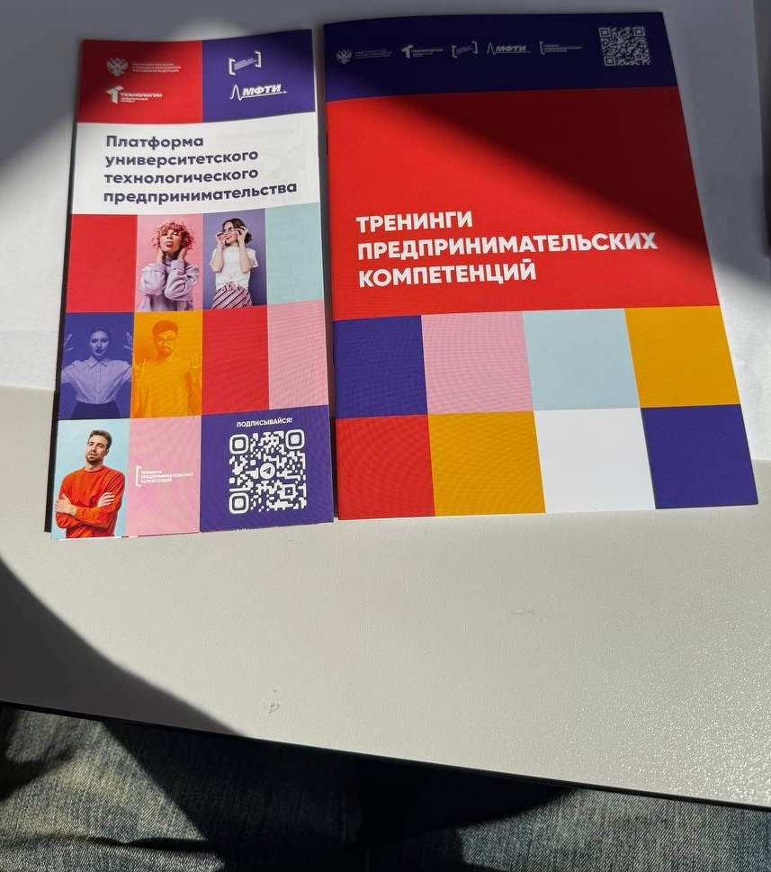
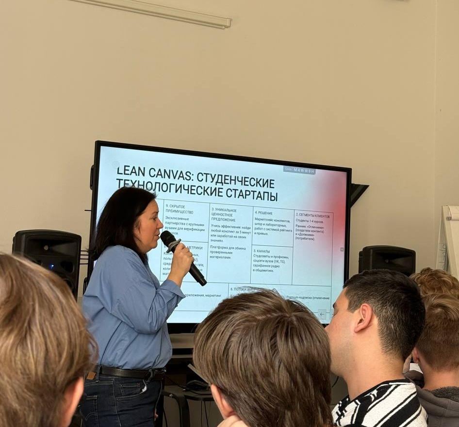
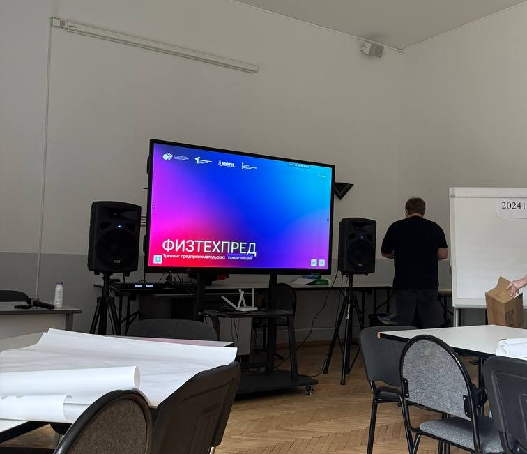

# Отчёт о взаимодействии с организацией-партнёром

## Мероприятие: Карьерный марафон в Московском Политехе  
**Дата участия:** 22 апреля 2025 г.
**Формат:** очное участие
**Время взаимодействия:** ~4 часа

## Цель участия

Принять участие в тренинге, чтобы:
- Создать идею IT-продукта в команде
- Освоить базовые этапы создания технологического стартапа и погрузиться в технологическое предпринимательство;
- Изучить методы креативного мышления (Мозговой штурм, фокус-объекты) для генерации инновационных идей;
- Развить навыки командной работы в условиях, приближенных к реальным бизнес-задачам.;

## Что было сделано

Во время мероприятия:

- Была определена роль в команде;
- В составе команды была выбрана проблемная область, сформулированно ценностное предложение и применены техники генерации идей;
- Проведен экспресс-анализ целевой аудитории, выполнил сегментацию рынка, определил уникальное торговое предложение и построил бизнес-модель на одном листе (Business Model Canvas);;
- Подготовлена презентация продукта и ее защита перед экспертами;

## Полученные знания и опыт

- Получено понимание критериев, по которым инвесторы и эксперты оценивают потенциал технологических стартапов на ранних стадиях.
- Освоены прикладные инструменты структурирования хаотичных идей в четкую бизнес-модель.
- Интенсивный формат деловой игры полностью подтвердил эффективность концепции «обучение через действие»: сквозное решение практических кейсов усваивается значительно глубже стандартного лекционного материала.

## Связь с проектом МосПолиФизикс

Посещененное мероприятие позволило посмотреть на мой проект **МосПолиФизикс** иначе:  
- Методология Lean Startup применима для создания быстрых пилотных медиа-форматов. Вместо долгой разработки дорогих интерактивных модулей эффективнее тестировать короткие спецпроекты на фокус-группах студентов и школьников, оперативно адаптируя подачу материала
- Инструменты Business Model Canvas помогли точнее сегментировать молодежную аудиторию и сформировать под каждую группу уникальное торговое предложение, упаковав сложную физику в трендовые визуальные форматы.
- Полученные знания о подаче проекта помогут лучше структурировать выступления и оформить их для презентаций

## Вывод

Тренинг «ФизТехпред» дал системное понимание процессов коммерциализации технологических и гуманитарных решений, сместив фокус с изолированного создания контента на построение востребованного аудиторией продукта.
Выяснялось что навыки продуктового мышления универсальны и необходимы любому разработчику и создателю мультимедиа-проектов для успешной работы в современных креативных и ИТ-индустриях. А участие в воркшопе помогло верифицировать свои навыки презентации, расширило портфолио опытом прохождения акселерационного цикла стартапа и подтверждено официальным сертификатом участника.

|Фотографии||
|:-:|:-:|
|||
|||

